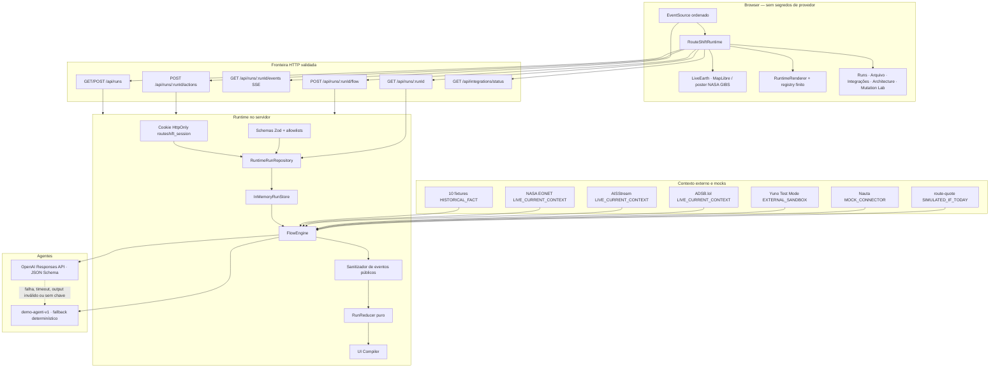
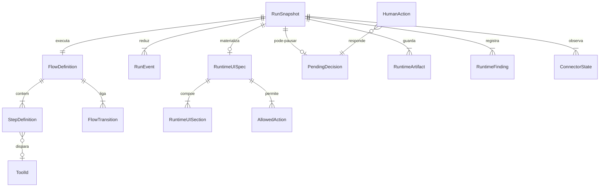
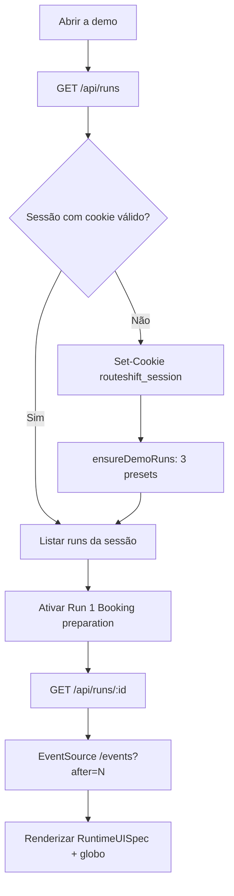
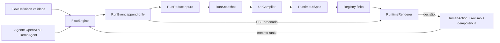
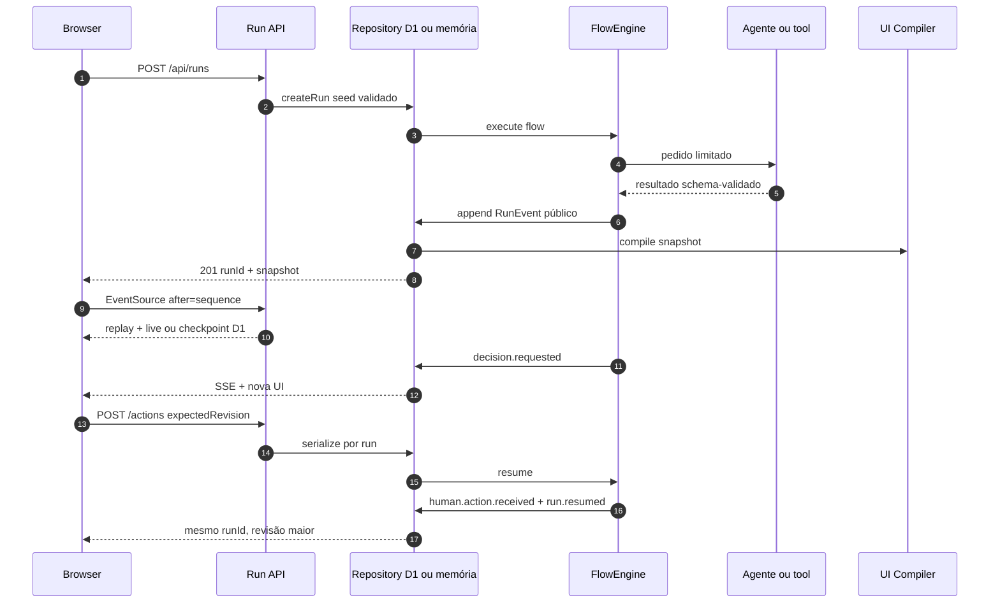
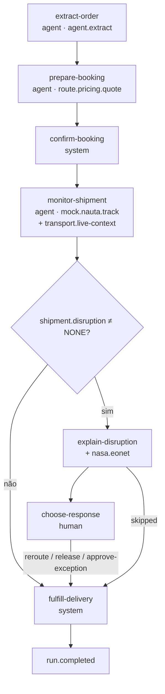
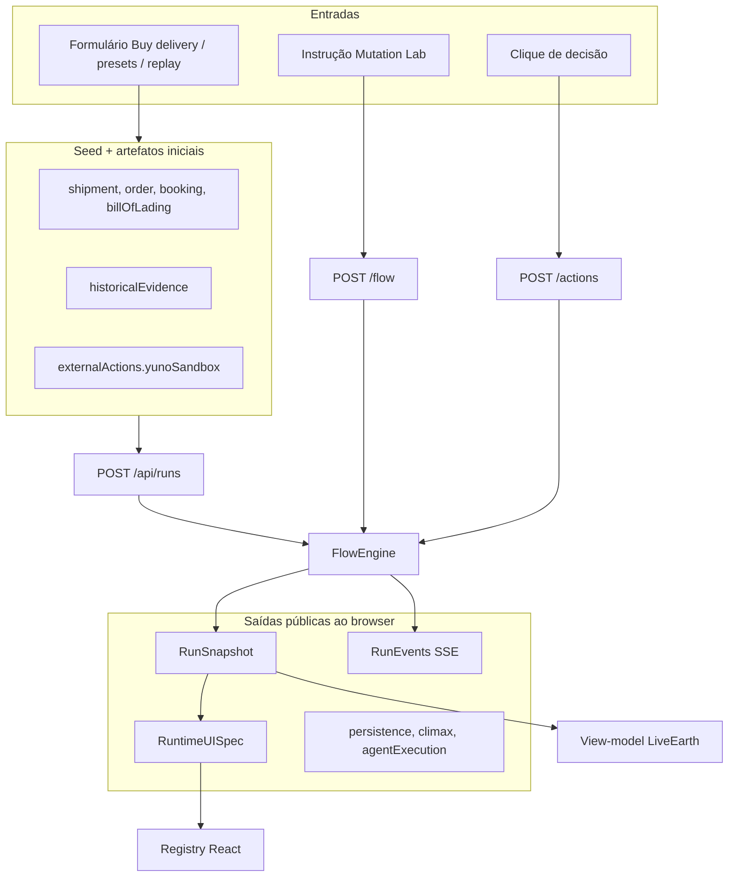
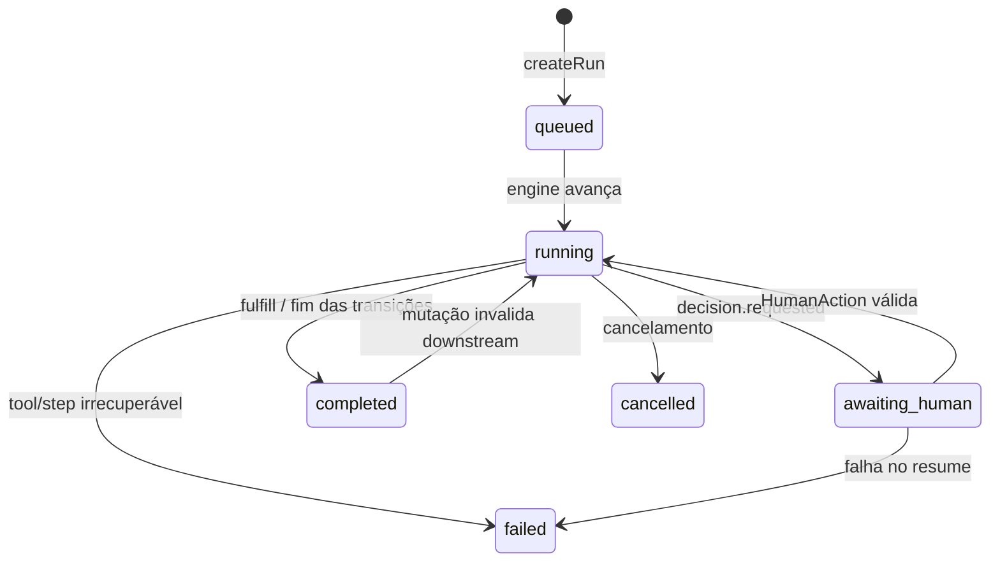

# RouteShift — fluxos e processos

RouteShift é uma experiência logística *flow-native* construída para o desafio NextWave 2026 **“The Interface That Builds Itself”**. Um jurado (ou comprador) cria uma entrega internacional a partir de um originário fixo em Xangai, aplica um dos dez incidentes históricos como se tivesse ocorrido hoje, e observa a interface operacional se recompor em torno do fluxo ativo, das evidências classificadas e das decisões humanas — sem gerar código arbitrário.

Este documento descreve **o que o produto faz e como o runtime executa isso**, com base no código deste repositório e na demo hospedada em [routeshift-nextwave-2026.kalmon4ever.chatgpt.site](https://routeshift-nextwave-2026.kalmon4ever.chatgpt.site/). Nada aqui inventa conectores, páginas ou estados que não existam.

**Marca:** RouteShift by JAIGO.  
**Promessa visível na demo:** *when reality changes, the interface changes with it.*

---

## Sumário

1. [O que é o produto](#1-o-que-é-o-produto)
2. [Arquitetura do sistema](#2-arquitetura-do-sistema)
3. [Entidades de domínio](#3-entidades-de-domínio)
4. [Telas e superfícies](#4-telas-e-superfícies)
5. [Jornadas de ponta a ponta](#5-jornadas-de-ponta-a-ponta)
6. [Processos internos](#6-processos-internos)
7. [Fluxo de dados](#7-fluxo-de-dados)
8. [Máquinas de estado](#8-máquinas-de-estado)
9. [Caminhos de erro e bordas](#9-caminhos-de-erro-e-bordas)
10. [Demo ao vivo versus código](#10-demo-ao-vivo-versus-código)

---

## 1. O que é o produto

RouteShift **não** é um dashboard estático de tracking. O mecanismo do produto é a própria interface: ela muda de compra e confirmação de pedido para rastreio específico do modal de transporte, sala de evidências, sala de decisão de reroteamento, orquestração de pagamento e entrega, conforme o que acontece com aquele `runId`.

O invariante está em `docs/architecture.md` e no painel Architecture da demo:

> **O fluxo é a fonte da experiência.** O React não escolhe o próximo passo de negócio. Uma `FlowDefinition` validada, o histórico append-only de `RunEvent` e o snapshot materializado de um run determinam a superfície operacional.

Contexto de hackathon:

- Repositório individual (`routeshift-nextwave-individual`), independente do repositório de equipe.
- Cliente-alvo: jurado NextWave agindo como comprador da **Muebles del Sur**.
- Nível declarado: Generative UI **4/5** — composição em tempo de execução a partir de intenção semântica validada; o nível 5 (geração arbitrária de código) é recusado de propósito.

O que o runtime prova, segundo o `README.md`:

- `FlowDefinition` estrita como contrato de execução.
- Eventos `RunEvent` append-only reduzidos a um `RunSnapshot` determinístico.
- Compilador semântico produz um `RuntimeUISpec` validado.
- Registry finito de componentes — sem JSX/HTML/CSS/código vindo do agente.
- SSE transmite eventos públicos ao browser.
- Decisões humanas pausam e retomam o **mesmo** `runId`.
- Mutação ao vivo do fluxo (ex.: “Validate Bill of Lading against booking before confirming”) sem rebuild.

---

## 2. Arquitetura do sistema

A aplicação é uma **SPA de uma única rota** (`app/page.tsx` → `RouteShiftRuntime`). Não há páginas Next/Vinext adicionais. Tudo que o usuário vê são superfícies compiladas, gavetas e diálogos no mesmo palco.

| Camada | Onde | Papel |
| --- | --- | --- |
| Browser | `components/runtime/`, `app/LiveEarth.tsx` | Shell, globo MapLibre, registry, SSE |
| HTTP + SSE | `app/api/runs/`, `app/api/integrations/status/route.ts` | Criação de run, snapshot, ações, mutação, status |
| Runtime | `lib/runtime/` | Engine, reducer, store, compiler, schemas Zod |
| Agente | `lib/agent/` | OpenAI Structured Outputs **ou** `DemoAgent` determinístico |
| Conectores | `lib/connectors/` | Yuno Sandbox, AISStream, ADSB.lol, NASA EONET, mock Nauta |
| Precificação | `lib/pricing/route-quote.ts` | Cotação logística **simulada**, separada do pagamento |
| Fluxos / fixtures | `lib/flows/`, `lib/demo/`, `app/scenarios.ts` | Flow Muebles del Sur, presets, 10 incidentes |
| Persistência | D1 (`db/schema.ts`) ou memória | Hospedado: D1; preview Node: `InMemoryRunStore` |

Stack (de `PRODUCT.md` / `package.json`): Vinext, React 19, TypeScript, Zod, Tailwind, shadcn/ui, MapLibre GL, SSE, Worker-compatible ESM.

### 2.1 Diagrama de arquitetura



### 2.2 Persistência e sessão (não é autenticação de usuário)

Não existe login, conta ou OAuth. Isolamento é por cookie de sessão:

- Nome: `routeshift_session`
- Formato: `rs_<uuid>`
- Flags: `HttpOnly; Secure; SameSite=Lax; Max-Age=604800` (7 dias)
- Implementação: `app/api/runs/_session.ts`

Na demo hospedada, `GET /api/runs` devolve `persistence: "D1_DURABLE"` e `singleProcess: false`. Cada sessão recebe os três runs-juiz bootstrapados (ver jornada 5.1). Um visitante **não** lista runs de outra sessão: mismatch de `session_id` vira HTTP 404.

Preview local (`ROUTESHIFT_NODE_PREVIEW=1`) usa memória de processo, rotulada na UI como *LOCAL MEMORY*. R2 **não** está configurado (`.openai/hosting.json` tem `"r2": null`).

### 2.3 APIs HTTP reais

| Método e caminho | Função | Arquivo |
| --- | --- | --- |
| `GET /api/runs` | Lista runs da sessão; bootstrap dos 3 presets se faltarem | `app/api/runs/route.ts` |
| `POST /api/runs` | Cria run (`demoId`, `label`, `seed`, `flow`, `idempotencyKey`) | idem |
| `GET /api/runs/:runId` | Snapshot + flow | `app/api/runs/[runId]/route.ts` |
| `GET /api/runs/:runId/events` | SSE (`Last-Event-ID` / `after`) | `app/api/runs/[runId]/events/route.ts` |
| `POST /api/runs/:runId/actions` | `HumanAction` (202) | `app/api/runs/[runId]/actions/route.ts` |
| `POST /api/runs/:runId/flow` | Mutação `insert-step` (instrução NL ou JSON) | `app/api/runs/[runId]/flow/route.ts` |
| `GET /api/integrations/status` | Booleans e modos públicos, **sem segredos** | `app/api/integrations/status/route.ts` |

Corpo JSON limitado a 65 536 bytes (`app/api/runs/_shared.ts`).

---

## 3. Entidades de domínio

Contratos canônicos em `lib/runtime/contracts.ts`.



| Entidade | Papel |
| --- | --- |
| **FlowDefinition** | Contrato de trabalho: `id`, `version`, `entryStepId`, steps, transições. Flow base: `muebles-del-sur-global-delivery` (`lib/flows/muebles-del-sur.ts`). |
| **StepDefinition** | Passo com `kind` (`extract`, `monitor`, `validate`, `decide`, `notify`, `fulfill`, `generic`), `owner` (`agent` / `human` / `system`), `capabilities`, `when`, `tool`. |
| **RunSnapshot** | Verdade materializada: `runId`, `revision`, `status`, steps concluídos/pulados, artefatos, findings, conectores, `latestUISpec`. |
| **RunEvent** | Fato público append-only, com `sequence` monotônico e `truth`. |
| **RuntimeUISpec** | Intenção de layout (nunca JSX). Seções tipadas + `allowedActions`. |
| **HumanAction** | `decisionId` + `actionId` + `expectedRevision` + `idempotencyKey`. |
| **FlowMutation** | Só `operation: "insert-step"` neste código. |
| **Scenario** | Fixture histórica (`EVT-…`) com proveniência `HISTORICAL_FACT` (`app/scenarios.ts`). |
| **RouteQuote** | Cotação ilustrativa em USD (`lib/pricing/route-quote.ts`). |

### Classificações de verdade (viajam com o dado; não são inferidas da cor)

| Classificação | Fonte observada | O que pode ser afirmado |
| --- | --- | --- |
| `HISTORICAL_FACT` | Arquivo de 10 incidentes | Evento datado da fonte citada; **não** “está acontecendo agora” |
| `LIVE_CURRENT_CONTEXT` | NASA EONET, AISStream, ADSB.lol | Observação recuperada no timestamp; **não** prova que a carga está no veículo |
| `EXTERNAL_SANDBOX` | Yuno Test Mode validado | Efeito em sandbox; **sem** movimento de dinheiro de produção |
| `SIMULATED_IF_TODAY` | Preço, ETA, correlação pedido↔veículo, consequências | Contrafactual determinístico |
| `MOCK_CONNECTOR` | Nauta e fallbacks | Contrato simulado, sem side-effect externo |
| `UNKNOWN` | Timeout, falta de config, evidência não verificada | Nenhuma conclusão |

---

## 4. Telas e superfícies

Não há rotas `/checkout`, `/tracking`, etc. A “tela” muda porque o compiler emite outro `RuntimeUISpec`. O palco permanente está em `components/runtime/RouteShiftRuntime.tsx`.

Na demo ao vivo, o HTML inicial já mostra:

- Marca **ROUTE / SHIFT by JAIGO**
- Readout de palco (`Runtime boot` até o snapshot chegar)
- Ações de header: **Runs**, **10 scenarios**, **Integrations**, **Architecture**
- Legenda de verdade (começa em `UNKNOWN`)
- Globo Terra com rota padrão *Shanghai → Iskenderun → Gaziantep* e atribuição NASA GIBS
- Estado de carga: *Reconstructing the operation / Folding validated events into the current run snapshot*
- Arquivo histórico (10 incidentes em inglês na UI)
- Painel de arquitetura (diagrama de 10 estágios)

### 4.1 Controles do header (sempre no palco)

| Controle | Componente | O que faz |
| --- | --- | --- |
| **Runs** | `RunSelector.tsx` | Lista runs isolados; formulário **Buy an international delivery**; três presets-juiz |
| **10 scenarios** | `HistoricalScenarioArchive.tsx` | Busca e replay dos dez incidentes; cada replay cria um **novo** run |
| **Integrations** | `IntegrationStatusPanel.tsx` | Lê `/api/integrations/status` + `connectorStates` do run ativo |
| **Architecture** | `ArchitecturePanel.tsx` | Diagrama pedagógico + prova do run (`runId`, revisão, owner) |

### 4.2 Superfície operacional gerada

`RuntimeRenderer` resolve cada `section.type` no registry (`components/runtime/component-registry.tsx`):

`route-map`, `booking`, `container`, `progress`, `alert`, `evidence`, `quote`, `refund`, `document-comparison`, `discrepancy`, `confidence`, `decision`, `action-result`, `event-feed`, `generic-step`.

Layouts semânticos: `focus`, `split`, `timeline`, `receipt`, `generic`. Prioridade `critical` acende a cena de incidente no palco.

### 4.3 Instrumentos de auditoria (quando há snapshot)

- **Flow graph** (`FlowGraph.tsx`) — trilha do flow, versão, revisão, passo atual / aguardando humano / pulado.
- **Public event stream** (`PublicEventFeed.tsx`) — últimos eventos públicos, estado SSE (`connecting` / `live` / `reconnecting` / `offline`).
- **Flow mutation lab** (`FlowMutationLab.tsx`) — inserir passo por instrução em inglês ou JSON; gatilho padrão do julgamento: *Validate Bill of Lading against booking before confirming.*
- Selo inferior: `LIVE SSE · DURABLE RUN` (hospedado) ou `LOCAL MEMORY` (preview).

### 4.4 Globo

`app/LiveEarth.tsx`: MapLibre com imagem orbital; fallback acessível (poster) se WebGL falhar. Estados da rota: `draft`, `planned`, `in-transit`, `disrupted`, `rerouted`, `held`, `delivered`, `unknown`. Tráfego AIS/ADS-B aparece como pontos de contexto, não como “seu navio”.

---

## 5. Jornadas de ponta a ponta

### 5.1 Primeira visita (demo hospedada)

Observado em 30 ago 2026 na URL pública:

1. Browser carrega a SPA (título da página igual ao `metadata` em `app/layout.tsx`).
2. Cliente chama `GET /api/runs`. O servidor define o cookie de sessão e, se a sessão é nova, `ensureDemoRuns` cria três runs (`app/api/runs/_shared.ts` + `lib/demo/muebles-del-sur-operation.ts`).
3. Resposta típica: `persistence: "D1_DURABLE"`, três itens:
   - **Run 1 — Booking preparation** — `completed` (entrada `extract-order`; o flow da fase corta após `prepare-booking`).
   - **Run 2 — Vessel departed** — `completed` (entrada `monitor-shipment`).
   - **Run 3 — Unexpected transshipment** — `awaiting_human` em `choose-response`.
4. O cliente anexa-se ao run 1 por padrão (label *Run 1 — Booking preparation*), abre SSE e pinta a superfície compilada.



### 5.2 Comprar uma entrega (“Buy delivery”)

Fluxo em `RunSelector` → `POST /api/runs` com `demoId: "booking-preparation"` e `seed` montado em `orderSeed()`:

1. Escolher produto (3 SKUs), destino (Gaziantep / Rotterdam / Atlanta), coordenadas editáveis, modal (`OCEAN_ROAD` / `OCEAN` / `RAIL_OCEAN` / `AIR`), prazo (14 / 30 / 45 dias).
2. Checkbox **Use Yuno Sandbox when configured** (ligado por padrão).
3. Cotação ilustrativa no formulário é **só UI** (`productValue * fator + promiseDays * 18`); a cotação autoritativa nasce no servidor via `route.pricing.quote`.
4. Originário permanece Xangai. Pedidos comprados são imutáveis: mudar produto/destino/modal cria **outro** run (`README.md`).

Na demo, os três presets-juiz **não** ligam `externalActions.yunoSandbox`; o Payment Link só entra quando o comprador envia o formulário com o checkbox marcado.

### 5.3 Alternar os três presets-juiz

Cada botão cria um run isolado (ou o bootstrap já o fez). A UI muda porque o **flow de fase** muda o `entryStepId` e corta transições (`flowForDemoPhase`):

| Preset | Fase | O que o jurado vê |
| --- | --- | --- |
| Booking preparation | Começa em `extract-order`, para após documentos/cotação | Booking, B/L, quote ~USD 4 178 no snapshot observado |
| Vessel departed | Começa em `monitor-shipment` | Timeline de container + tráfego vivo se o conector responder |
| Unexpected transshipment | Começa em `explain-disruption` | Evidência histórica EVT-014, NASA EONET, Nauta mock, decisão humana |

### 5.4 Replay de incidente histórico

Arquivo → escolher um dos dez → `Replay now`:

- Cria run com `demoId: "unexpected-transshipment"`, label `Historical replay — {shortName}`, `idempotencyKey` UUID (reutilizado se o replay falhou).
- Seed: `buildHistoricalReplaySeed` (`lib/demo/historical-replay.ts`) — fato histórico separado da consequência `SIMULATED_IF_TODAY`.
- Aviso na UI: *A replay creates a new isolated simulated run. It causes no external booking or payment action.*

Os dez incidentes (IDs em `app/scenarios.ts`; rótulos **em inglês** na UI da demo):

1. Delta / CrowdStrike (`EVT-012`)
2. Iskenderun earthquake (`EVT-014`)
3. NotPetya / Maersk (`EVT-017`)
4. Ever Given / Suez (`EVT-001`)
5. Baltimore bridge (`EVT-005`)
6. Panama Canal drought (`EVT-004`)
7. Extreme rain in Dubai (`EVT-008`)
8. British Columbia floods (`EVT-009`)
9. CN + CPKC shutdown (`EVT-011`)
10. ILA port strike (`EVT-010`)

### 5.5 Mutação ao vivo do fluxo (trial by fire)

1. Abrir **Change the flow**.
2. Enviar a instrução (ou JSON) para `POST /api/runs/:runId/flow`.
3. Servidor: `inferFlowMutationWithTelemetry` (`lib/runtime/infer-step-semantics.ts`) → OpenAI estruturado **ou** `DemoAgent` (detecta B/L vs booking).
4. Engine insere o passo, incrementa `flow.version`, invalida trabalho downstream afetado, emite `flow.definition.updated`, `step.discovered`, `ui.spec.emitted`.
5. Quando a comparação B/L vs booking **não bate** (fixtures deliberadas: POD `TRISK` vs `TRMER`, peso 18 240 vs 19 050 kg), o run pausa com decisão.
6. Humano escolhe **Request corrected B/L** ou **Approve exception** — mesmo `runId`, revisão maior.
7. Em embarque **AIR**, a condição `transportMode in [OCEAN, OCEAN_ROAD, RAIL_OCEAN]` gera `step.skipped`.

Frase de clímax devolvida pela API: `FLOW CHANGED → ARI UNDERSTOOD → UI RECOMPOSED`.

### 5.6 Decisão humana em transbordo

No passo `choose-response` (owner `human`), ações allowlisted (`actionsForStep` em `flow-engine.ts`):

- **Approve reroute** → mock Nauta `REROUTE` + requote RouteShift; segue para `fulfill-delivery`.
- **Hold and monitor** / **Escalate** → nova decisão (release / reroute / escalate again); o run **permanece** `awaiting_human`.
- **Release** (após hold) → mock Nauta `RELEASE`.

Ações com `requiresConfirmation: true` pedem `window.confirm` no cliente (“mock operation with no external side effect”).

---

## 6. Processos internos

### 6.1 Ciclo de execução (invariante)



Passo automático: condição → tool/capability → eventos públicos → fold → recompile UI.  
Passo humano: `decision.requested` + `run.awaiting_human` e **para**. Ação com revisão atual emite `human.action.received` + `run.resumed`.

### 6.2 Sequência: criar run, stream e decidir



Hospedado (D1): o Worker devolve um **checkpoint SSE finito** (`stream-checkpoint`) porque o Sites bufferiza bodies abertos; o EventSource nativo reconecta com `Last-Event-ID`. Preview em memória: stream aberto, heartbeat 15 s, poll 1 s.

Cliente: gap de `sequence` força refetch do snapshot e reconnect (`RouteShiftRuntime`).

### 6.3 Flow Muebles del Sur (passos e transições)



Fases de demo **encurtam** esse grafo (não executam o restante).

### 6.4 Pipeline de agente

1. Sem `OPENAI_API_KEY`, ou em qualquer falha: `demo-agent-v1`.
2. Com chave: Responses API, JSON Schema estrito, timeout padrão 12 s (`lib/agent/openai-agent.ts`). A UI mostra `providerMode: live | deterministic_fallback` e o modelo público.
3. Na demo observada, o Run 1 chegou a emitir `providerId: openai-structured-agent-v1`, `providerMode: live`, `model: gpt-5-mini`.
4. Comparação documental **determinística** permanece autoritativa (`DemoAgent.compareDocuments`): campos bloqueantes incluem `portOfDischarge`, `grossWeightKg`, etc.
5. O agente **não** escolhe componentes React, URLs arbitrárias nem chain-of-thought (`lib/runtime/public-events.ts`).

### 6.5 Precificação versus pagamento

```mermaid
sequenceDiagram
    participant E as FlowEngine
    participant Q as calculateRouteQuote
    participant Y as Yuno Sandbox
    participant U as UI quote section

    E->>Q: distanceKm, modal, valor, promiseDays
    Q-->>E: RouteQuote USD SIMULATED_IF_TODAY
    E->>U: seção quote
    alt buyer opt-in yunoSandbox e credenciais sandbox
        E->>Y: Payment Link delayed capture Test Mode
        Y-->>E: IDs públicos + checkout URL allowlisted
        Note over E,Y: EXTERNAL_SANDBOX · sem captura automática
    else sem config ou sem opt-in
        Note over E: sem link; payment.status not-requested
    end
```

Yuno: host fixo `api-sandbox.y.uno`; produção recusada. Adapter tem lookup / capture / cancel-or-refund, mas **a UI atual não dispara capture nem estorno automaticamente** (`docs/live-integrations.md`, `docs/security-boundaries.md`).

Nauta: `lib/connectors/mock-nauta.ts` — milestones, ETA +9 dias no transbordo, posição estimada fixa. Sem contrato sandbox público verificado.

### 6.6 Contexto vivo (corredor, não atribuição de carga)

| Conector | Credencial | Comportamento no engine |
| --- | --- | --- |
| NASA EONET | Nenhuma | Passos com `incident.explain`; TTL 5 min; timeout limitado |
| AISStream | `AISSTREAM_API_KEY` | WebSocket servidor, bounding box do destino, janela curta |
| ADSB.lol | Nenhuma | Runs `AIR`, raio no destino, atribuição ODbL |
| Integrações panel | — | “configured” ≠ “observed”; só eventos validados mudam o run para `available` |

Na demo, `/api/integrations/status` mostrou OpenAI, Yuno e AISStream **configurados no servidor**; NASA e ADSB como fontes públicas; Nauta `sponsor-access-required`. No Run 3 observado, `NASA_EONET` estava `available` com `eventCount: 12` e finding `LIVE_CURRENT_CONTEXT` — contexto presente, **não** validação do terremoto de 2023.

### 6.7 Webhooks

Não há endpoints de webhook de provedor neste repositório. Yuno não registra callback inbound aqui; o fluxo é request/response no momento do quote. “Webhooks” no sentido de produto **não existem**.

---

## 7. Fluxo de dados



O globo **não** lê o provedor AIS diretamente: deriva origem/destino/waypoints de seções `route-map` e artefatos, e pontos de tráfego de `artifacts.liveTransportContext`.

---

## 8. Máquinas de estado

### 8.1 Status do run (`RUN_STATUSES`)



Reducer: `lib/runtime/reducer.ts`. Mutação de flow pode reabrir um run `completed`.

### 8.2 Passo no flow graph (UI)

`queued` → `current` → `complete`, ou `waiting` se `awaiting_human`, ou `skipped` se a condição `when` falhar.

### 8.3 Conector

`idle` → `running` → `available` | `stale` | `unavailable` | `failed`.

### 8.4 Conexão SSE no cliente

`connecting` → `live`; erro → `reconnecting` ou `offline`; checkpoint D1 esperado **não** é tratado como queda.

### 8.5 Cena visual do palco (`sceneClass`)

Mapeia snapshot/spec para classes CSS: boot, operation, transit, incident, decision, delivered — alinhado à gramática de `DESIGN.md` (noite → dia, hold âmbar, etc.), implementada como cenas nomeadas, não como páginas.

---

## 9. Caminhos de erro e bordas

Todos observados no código (e vários exercitados por testes em `tests/`).

| Situação | Comportamento |
| --- | --- |
| Revisão velha na ação humana | HTTP **409** `RunConflictError` (“Run revision is stale…”) |
| `idempotencyKey` repetida | Retorna o run **sem** reexecutar a ação |
| Decisão inexistente / run não está `awaiting_human` | 409 |
| `actionId` fora da allowlist da decisão | 400 `RunInputError` |
| Run de outra sessão | 404 |
| JSON inválido / body grande | 400 |
| Instrução de mutação com script/`eval`/HTML | rejeitada (`infer-step-semantics.ts`) |
| Versão de flow velha na mutação | 409 |
| OpenAI timeout / schema inválido | fallback determinístico visível |
| Yuno pedido mas sem credencial | conector `unavailable` / `UNKNOWN`; **não** inventa link |
| Yuno configurado mas resposta inválida | `failed` + nota pública sem detalhe de erro do provedor |
| AIS/EONET/ADS-B falham | `UNKNOWN` ou stale; demo core segue |
| Coordenadas inválidas no form | erro local, não chama API |
| Runtime local/hospedado indisponível | tela *The local runtime is unavailable* + Retry |
| Gap de sequência SSE | refetch snapshot + novo EventSource |
| 3 falhas seguidas de poll D1 no preview | fecha o stream |
| Ciclo de steps > 4 visitas ou > 96 automáticos | erro de engine |
| Ação destrutiva na UI | `window.confirm` obrigatório |
| Pedido AIR + passo B/L marítimo | `step.skipped` |

Limite de execução automática: `MAX_AUTOMATIC_STEPS = 96` (`flow-engine.ts`).

---

## 10. Demo ao vivo versus código

Verificação da demo em **30 ago 2026** via HTML público e `GET /api/runs`, `GET /api/runs/:runId`, `GET /api/integrations/status`. O MCP de browser do Cursor não manteve uma aba estável o suficiente para clicar como usuário (criação de tab / `viewId` inconsistentes); a evidência de UX veio do HTML hidratável, das APIs e do código cliente que as alimenta.

| Tópico | Código | Demo ao vivo | Notas |
| --- | --- | --- | --- |
| Persistência | D1 se bound; memória se `ROUTESHIFT_NODE_PREVIEW` / preview | `D1_DURABLE` | Alinhado ao README hospedado |
| Bootstrap de 3 runs | `ensureDemoRuns` | Três labels juiz presentes | Alinhado |
| Idioma da UI | Fixtures PT em `scenarioFixtures` + overlay `englishScenarioCopy` | Arquivo e shell em **inglês** | Export `scenarios` sempre aplica o overlay inglês |
| `PRODUCT.md` “local-only until publication” | Texto do produto | App público em `*.chatgpt.site` | Documento de produto **desatualizado** em relação ao hosting |
| `PRODUCT.md` “não depende de AIS/OpenSky” | AISStream + ADSB.lol implementados | AISStream `configured: true` | Texto de produto atrasado; `docs/live-integrations.md` está correto |
| OpenAI | Opcional | `configured: true`; Run 1 usou modo `live` / `gpt-5-mini` | Juiz ainda funciona sem chave (fallback) |
| Yuno | Opt-in + sandbox | `configured: true`, modo `external-sandbox` | Presets juiz **não** criam Payment Link; só o formulário Buy delivery com checkbox |
| Nauta | Mock explícito | `configured: false`, `MOCK_CONNECTOR` | Alinhado |
| NASA EONET | Público | Run 3: `available`, 12 eventos | Contexto corrente, não prova do cenário histórico |
| Formulário Buy delivery | Existe no `RunSelector` | Não está no HTML da primeira pintura (gaveta **Runs** fechada) | Precisa abrir Runs |
| Painel Architecture | Cliente | Presente no HTML inicial | Pode ser lido mesmo durante *Reconstructing…* |
| Auth | Só cookie de sessão | `Set-Cookie: routeshift_session=rs_…` | Sem login |
| Webhooks / captura Yuno automática | Não | Não observado | Não inventar |

Limitações honestas (código + README), válidas na demo:

- D1 é durabilidade de hackathon, não histórico de conta.
- AIS/ADS-B ≠ “carga a bordo”.
- Preço RouteShift é simulado.
- Registry finito de propósito.
- Pedido comprado é imutável neste protótipo.

---

## Fontes neste repositório

- Visão: `README.md`, `PRODUCT.md`, `DESIGN.md`
- Runtime: `docs/architecture.md`, `docs/security-boundaries.md`, `docs/live-integrations.md`, `docs/truth-and-provenance.md`, `docs/demo-script.md`
- Contratos: `lib/runtime/contracts.ts`
- Engine / store / compiler: `lib/runtime/flow-engine.ts`, `run-store.ts`, `runtime-run-repository.ts`, `reducer.ts`, `ui-compiler.ts`
- Shell: `components/runtime/RouteShiftRuntime.tsx`
- Flow e fixtures: `lib/flows/muebles-del-sur.ts`, `lib/demo/muebles-del-sur-operation.ts`, `app/scenarios.ts`

Integrações opcionais (somente servidor, nomes em `.env.example`, **sem valores**): `OPENAI_API_KEY`, `AISSTREAM_API_KEY`, `YUNO_ACCOUNT_CODE`, `YUNO_PUBLIC_API_KEY`, `YUNO_PRIVATE_SECRET_KEY`.
