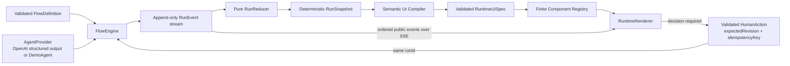
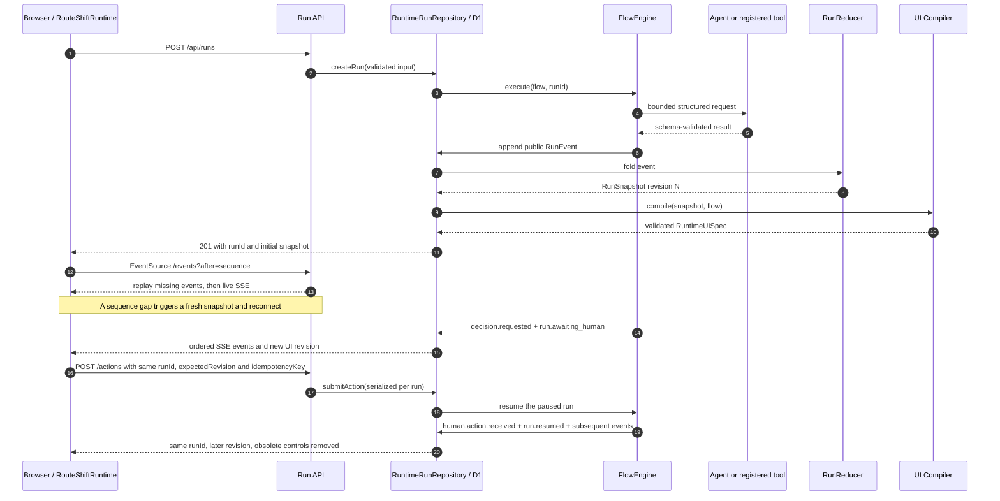
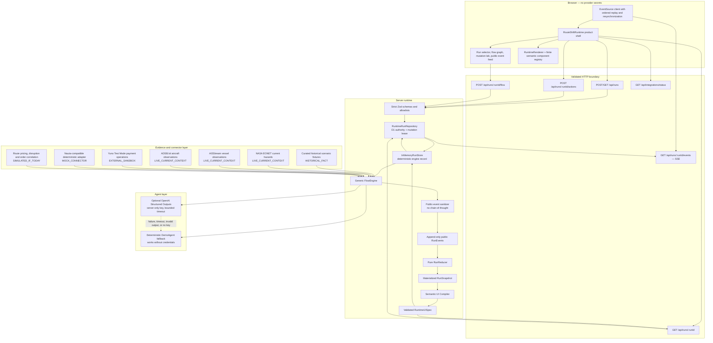

# RouteShift Runtime Architecture

## Core invariant

**The flow is the source of the experience.** React does not decide which business step runs next. A strict, validated `FlowDefinition`, its append-only event history, and the materialized state of one run determine the active operational interface.

## End-to-end operational flow

The loop below is the actual control path. A human decision does not create a replacement run: the validated action is appended to the same event stream, and execution resumes with the same `runId`.

For an uninterrupted step, the engine evaluates the step condition, executes a registered tool or semantic capability, emits public events, reduces those events into the snapshot, and recompiles the UI. For a human-owned decision, it emits `decision.requested` and `run.awaiting_human`, then stops. A permitted action submitted with the active revision emits `human.action.received`; the same run emits `run.resumed` and continues. Stale revisions return HTTP 409, and repeated idempotency keys cannot repeat the action.

## Runtime sequence and browser synchronization

The SSE endpoint uses each event sequence as the SSE `id`, accepts `Last-Event-ID` or the `after` query parameter, sends heartbeat comments, and cleans up on abort. In the hosted D1 runtime, replay plus one-second polling exposes only committed events and a failed poll closes after three attempts so EventSource can reconnect. The explicit in-memory preview subscribes before replay for immediate delivery. The client processes events in order and refreshes the snapshot if it detects a sequence gap. The D1 snapshot is authoritative; SSE is its incremental delivery channel, not a separate execution clock.

## Layered system architecture

All external credentials stay on the server. Provider payloads are bounded, parsed, and normalized before becoming public events or artifacts. The browser receives only the validated snapshot, semantic UI specification, public IDs, safe evidence URLs, and concise public agent summaries.

## Truth and connector boundary

The classification travels with the result; it is not inferred from the visual surface.

| Canonical classification | Current source or behavior                                                                         | What RouteShift may claim                                                                                                          |
| ------------------------ | -------------------------------------------------------------------------------------------------- | ---------------------------------------------------------------------------------------------------------------------------------- |
| `HISTORICAL_FACT`        | Ten curated, cited disruption fixtures                                                             | A dated event was reported by the cited source; not that the event is occurring now.                                               |
| `LIVE_CURRENT_CONTEXT`   | NASA EONET, AISStream, and ADSB.lol                                                                | A validated observation was retrieved at the displayed time; not that a simulated order is affected or aboard an observed vehicle. |
| `EXTERNAL_SANDBOX`       | Successful Yuno Test Mode requests                                                                 | An external test-environment operation occurred with no production money movement.                                                 |
| `SIMULATED_IF_TODAY`     | Route pricing, scenario consequences, shipment-to-vehicle correlation, and counterfactual outcomes | A deterministic present-day simulation, never an observed external fact.                                                           |
| `MOCK_CONNECTOR`         | Nauta-compatible operations and deterministic connector fallbacks                                  | The expected contract and operational effect were simulated locally; no external side effect is claimed.                           |
| `UNKNOWN`                | Missing, rejected, timed-out, stale-without-cache, or unverified evidence                          | No conclusion is drawn from unavailable evidence.                                                                                  |

Yuno is `EXTERNAL_SANDBOX` only when the external Test Mode response is validated; its local fallback remains `MOCK_CONNECTOR`. Nauta remains a mock because this repository has no verified public self-service sandbox contract. AISStream and ADSB.lol show nearby current traffic, while order-to-vessel or order-to-aircraft assignment remains simulated unless an independent real booking identifier proves the association.

## Runtime boundaries and ownership

- `lib/runtime/contracts.ts` defines the domain contracts.
- `lib/runtime/schemas.ts` validates external and runtime values, including bounded steps, events, sections, actions, tools, URLs, text, arrays, and payload sizes.
- `lib/runtime/flow-engine.ts` evaluates conditions and executes generic step semantics from kind, capabilities, inputs, and registered tools.
- `lib/runtime/public-events.ts` removes non-public material and enforces the public/private reasoning boundary.
- `lib/runtime/reducer.ts` is the pure, replayable fold from ordered events to state.
- `lib/runtime/run-store.ts` owns deterministic execution records, idempotency, and same-isolate subscriptions.
- `lib/runtime/runtime-run-repository.ts` makes D1 authoritative when bound, scopes runs to one browser session, leases mutations, and hydrates the deterministic engine. Explicit Node previews use the in-memory fallback.
- `lib/runtime/ui-compiler.ts` maps capabilities, current state, and validated output shapes to a bounded UI specification.
- `components/runtime/component-registry.tsx` is the finite rendering authority.
- `components/runtime/RouteShiftRuntime.tsx` creates or attaches to runs, maintains isolated client state per run, and synchronizes through snapshots and SSE.

The engine, compiler, registry, and renderer do not branch on a scenario ID, trial step ID, or trial title. IDs establish identity; registered kinds, capabilities, tool contracts, state, and output shapes establish behavior. An unknown but valid step renders through `GenericStepSection`; an unsafe or unregistered instruction is rejected.

## Predefined versus dynamically compiled

Predefined in source are:

- strict schemas and size limits;
- registered tools, actions, semantic capabilities, and connector contracts;
- the finite UI section registry;
- the Muebles del Sur base flow and deterministic demo fixtures;
- public-event sanitization, reducer rules, and truth classifications.

Determined at runtime are:

- inserted validated steps and flow version;
- conditions, skipped steps, execution path, and current owner;
- findings, artifacts, connector states, and pending decisions;
- UI section selection, focus, priority, truth context, and permitted actions;
- downstream invalidation after an upstream flow or input change.

The agent may classify a bounded natural-language instruction, compare structured documents, report public findings and confidence, and recommend one permitted action. It cannot choose React components, markup, CSS, imports, executable code, arbitrary tools, arbitrary URLs, or private reasoning content.

## Determinism, isolation, and persistence

Each run has one immutable `runId`, a monotonic event sequence, a monotonic revision, a flow version, an event history, and a materialized snapshot. Per-run changes are serialized, and the store keeps separate records and listeners for simultaneous runs. Replaying the same validated events reconstructs a deeply equal snapshot.

When a flow insertion affects completed downstream work, RouteShift invalidates affected completed and skipped markers, artifacts, connector states, findings, and the prior agent summary before resuming execution. The UI then recompiles from the new snapshot, so obsolete operational surfaces and decision controls leave the DOM.

On Sites, D1 stores the validated flow, materialized snapshot, bounded event history, revision, and session scope. A short conditional lease prevents two stateless requests from mutating one run simultaneously, and a conditional revision update rejects stale commits. Hosted SSE replays and polls committed D1 sequences; the fast same-isolate listener is used only by the non-durable in-memory preview.

The explicit Node preview keeps `InMemoryRunStore` as a non-durable fallback. Hosted D1 is still not a user account or indefinite archive: the anonymous session cookie expires, records are bounded to the demo, and R2 is not configured. Durable Objects would provide actor-native streaming but are not required for this bounded proof.

## Why the finite registry matters

`RuntimeUISpec` contains semantic layout intent, priority, ownership, focus, truth context, bounded section data, and allowed actions. It never contains JSX, HTML, CSS, JavaScript, imports, or arbitrary component names. The compiler can therefore recompose the experience while the component registry remains a finite security and accessibility boundary. This proves Generative UI behavior without evaluating agent-generated code.
